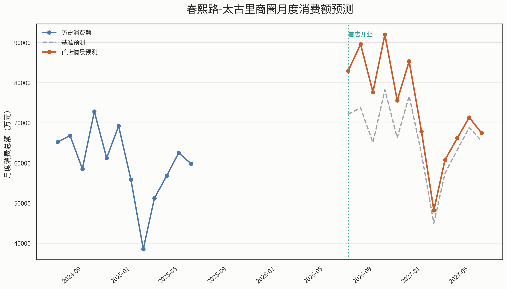
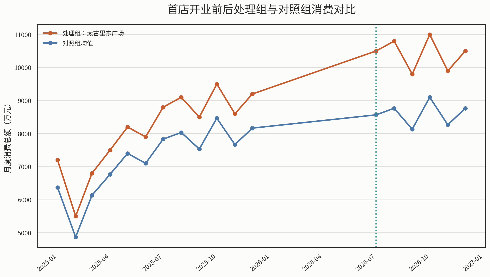
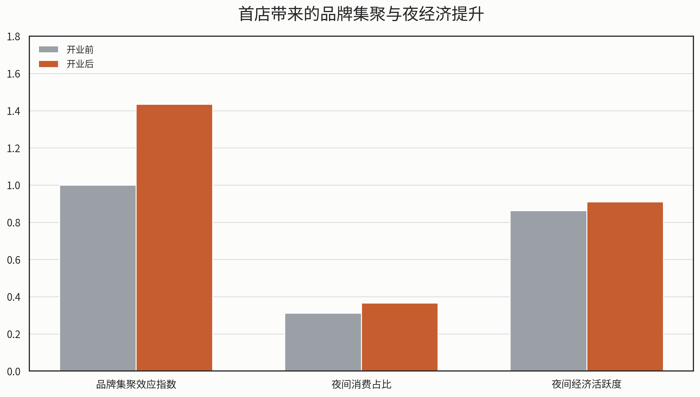

# 成都首店经济的商圈活力识别、选址优化与消费效应研究

## 摘要

围绕“首店经济”背景下城市商业空间优化与品牌落位决策问题，本文以成都为研究对象，构建“商圈消费活力评价-茶饮首店选址优化-首店消费效应预测-政策建议”四位一体的分析框架。针对问题一，本文基于商业规模、商业密度、商业成熟度、客流活跃度、核心吸引力、成长潜力和成本压力等 7 个指标，采用 AHP-熵权组合赋权方法，对成都主要商圈进行消费活力量化评价，并将其划分为高活力核心型、传统优势型、成长潜力型、社区稳定型和区域均衡型五类，得到成都商圈“中心双核强集聚，次级商圈梯度承接，近郊组团外拓延伸”的总体格局。针对问题二，本文构建包含客群匹配、消费支撑、客流潜力、交通可达和成本竞争环境在内的选址评价体系，利用 AHP-熵权-TOPSIS 模型对 12 个候选区域进行排序，结果显示太古里东广场核心区为成都茶饮首店最优落位点，并形成“全局最优点 + 分商圈代表点”的分层推荐结构。针对问题三，本文以春熙路-太古里商圈为研究对象，采用对数 SARIMAX 模型预测 2026 年 7 月至 2027 年 6 月首店落地后的月度消费总额变化，并以对数 DID 模型估计首店带来的净拉动效应。结果表明，首店开业后第 2 个月总效应达到峰值，约为 21.56%，预测期平均月度净增消费额约为 7552.23 万元，净消费拉动效应约为 7.96%；同时，品牌集聚效应指数提升 0.43，夜间经济活跃度提升约 0.05，说明首店能够通过品牌跟随进入和夜间消费扩展形成持续正向溢出效应。最后，针对问题四，本文提出分层布局、分类引店、动态监测和多场景联动的政策建议，为市商务局优化商业网点布局和提升首店经济治理效率提供定量支撑。

**关键词：** 首店经济；消费活力；AHP-熵权法；TOPSIS；SARIMAX；双重差分法

---

## 1 问题重述

“首店经济”是指一个区域利用区位、客流、消费结构和政策环境等综合优势，吸引品牌在本区域首次开设门店，并通过品牌引入带动消费提升、商圈升级和城市形象塑造的经济形态。随着城市竞争由增量扩张逐步转向质量提升，首店不再只是招商项目，而成为推动商业布局优化、消费升级与文商旅融合的重要抓手。

题目给定多源商业与消费数据，要求围绕某新一线城市开展四个层层递进的问题研究：第一，构建商圈消费活力评价指标体系，对主要商圈进行分类并分析空间分布特征；第二，在给定某中高客单价新式茶饮品牌的条件下，推荐 3 个最优首店落位区域；第三，预测首店落地后所在商圈未来一年内的月度消费总额变化趋势，并分析首店带来的品牌集聚效应和溢出效应；第四，基于前三问结果，向市商务局提出针对性的政策建议。

综合题目要求与现有数据质量，本文最终选择成都作为唯一研究城市，并围绕“商圈评价-选址优化-效应预测-政策建议”的主线展开建模。

---

## 2 模型假设

为保证模型具有可操作性和结果可解释性，本文作如下基本假设：

1. 研究期内成都总体宏观消费环境未发生颠覆性突变，商圈层级结构保持基本稳定。
2. 题目提供及补充整理后的样本数据能够代表成都主要商圈与核心候选区域的相对水平。
3. 问题二所讨论的品牌定位为中高客单价茶饮品牌，目标客群为 18-30 岁年轻群体，因此“消费能力匹配度”对选址结果具有重要影响。
4. 问题三中首店计划于 2026 年 7 月开业，开业效应呈现“初期放大-短期峰值-逐步衰减”的一般规律。
5. DID 面板数据和品牌集聚样本用于类比估计净效应参数，其结果反映的是“可比情景下的首店净效应”，而非真实开业后的完整回归追踪。

---

## 3 符号说明

| 符号 | 含义 |
|---|---|
| $x_{ij}$ | 第 $i$ 个样本在第 $j$ 个指标上的原始值 |
| $x'_{ij}$ | 标准化后的指标值 |
| $w_j$ | 第 $j$ 个指标的组合权重 |
| $S_i$ | 第 $i$ 个商圈的消费活力综合得分 |
| $C_i$ | TOPSIS 贴近度系数 |
| $Y_t$ | 第 $t$ 月商圈消费总额 |
| $\alpha$ | AHP-熵权组合赋权中的主观权重系数 |
| $Treatment_i$ | DID 模型中处理组虚拟变量 |
| $Post_t$ | DID 模型中开业后时期虚拟变量 |
| $\beta$ | 首店开业带来的净效应系数 |

---

## 4 数据来源与预处理

本文使用的数据包括全国商圈明细、成都商圈归并数据、候选区域交通与客群指标、租金成本数据、竞争环境数据、月度消费数据、季节性因素表、类比 DID 面板数据以及品牌集聚与夜经济数据等。考虑到原始样本存在粒度不统一、说明文字混入数据行、部分月份缺口和部分商圈需要人工归并等问题，本文在建模前完成了以下预处理：

1. 对原始商圈点位数据进行人工归并，形成更符合城市商业现实的商圈级分析单元。
2. 对包含说明文字和备注信息的 CSV 文件进行清洗，保留有效数据行。
3. 对不同量纲变量进行数值化和极差标准化处理。
4. 在问题三中，对节假日和季节性变量进行月度对齐，并对未来预测月份进行同月模板延展。
5. 对问题二和问题三中需要场景假设的变量，保留明确参数表，保证模型透明可复现。

---

## 5 问题一 商圈消费活力评价指标体系构建

### 5.1 研究对象与分析思路

结合前期多城市背景比较结果，本文最终选择成都作为研究对象。原因在于：一方面，成都具备较强的年轻消费群体基础与首店政策支持，符合新式茶饮品牌的目标客群特征；另一方面，成都核心商圈层级清晰，既有春熙路-太古里这类城市地标型消费极，也有盐市口-天府广场等传统核心商圈，以及建设路、双楠、科华南路和近郊新城等不同功能层级商圈，适合开展消费活力的分层评价与空间比较。

针对问题一，本文采用“指标构建-数据标准化-组合赋权-综合评分-类型划分-空间分析”的技术路线。首先依据商业发展规律与题目要求，从商业规模、商业密度、商业成熟度、客流活跃度、核心吸引力、成长潜力和成本压力七个方面构建评价体系；其次，对不同量纲指标进行无量纲化处理；然后结合主观判断与客观信息，采用 AHP-熵权组合赋权方法计算指标权重；最后得到成都主要商圈消费活力综合得分，并据此划分商圈类型、分析空间分布格局。

### 5.2 商圈分析单元构建

原始数据中既包含具体商场点位，也包含少量重点商圈信息，直接以单个百货或单个门店作为评价对象，不利于反映真实商圈结构。因此，本文在尊重原始数据来源的基础上，对成都样本进行人工归并，形成 6 个更符合城市商业实际的商圈级分析单元，分别为：春熙路-太古里核心商圈、盐市口-天府广场商圈、建设路-万达商圈、双楠生活商圈、科华南路商圈和近郊新城商圈组团。

其中，春熙路-太古里核心商圈代表成都最具地标属性和外部吸引力的核心消费区；盐市口-天府广场商圈体现传统中心商圈的商业积淀与规模优势；其余商圈则分别代表次级成长型、社区成熟型、区域生活型和近郊拓展型商业空间。

### 5.3 评价指标体系构建

结合题目要求与现有数据条件，本文最终构建 7 个核心指标，如表 1 所示。

#### 表 1 商圈消费活力评价指标体系

| 指标名称 | 指标含义 | 指标方向 | 说明 |
|---|---|---|---|
| 来源点位数 | 商业规模 | 正向 | 反映商圈内可识别商业点位的数量 |
| 商场样本数 | 商业密度 | 正向 | 反映商圈商业载体集聚程度 |
| 商圈成熟度指数 | 商业成熟度 | 正向 | 综合样本数、街区属性等构建的成熟度指标 |
| 客流活跃度代理 | 客流活跃度 | 正向 | 重点商圈用客流明细，其他商圈按层级和先验信息估计 |
| 核心吸引力指数 | 核心吸引力 | 正向 | 衡量商圈是否具有城市地标、文旅外溢和品牌首选属性 |
| 类型潜力分 | 成长潜力 | 正向 | 根据商圈功能层级赋予发展潜力基准值 |
| 成本压力代理_租金 | 租金成本压力 | 逆向 | 反映商圈租金水平对经营可持续性的约束 |

上述指标中，前六项为正向指标，即指标值越大代表商圈消费活力越强；租金成本压力为逆向指标，即租金越高，对商圈中普通品牌的进入和持续经营约束越强，因此应在综合评价中作逆向处理。

### 5.4 模型构建与权重确定

#### 5.4.1 指标标准化

由于各指标量纲不同，本文采用极差标准化方法进行无量纲化处理。对于正向指标，采用式（1）：

$$
x'_{ij}=\frac{x_{ij}-\min(x_j)}{\max(x_j)-\min(x_j)}
$$

对于逆向指标，采用式（2）：

$$
x'_{ij}=\frac{\max(x_j)-x_{ij}}{\max(x_j)-\min(x_j)}
$$

从而使各指标值均映射到 $[0,1]$ 区间，便于后续综合评价。

#### 5.4.2 组合赋权方法

仅使用熵权法会导致“波动大但未必最重要”的指标权重被放大，而只依靠主观判断又会削弱数据客观性。因此，本文采用 AHP-熵权组合赋权方法。具体地，先依据商圈消费活力形成机制给出主观权重，再利用熵权法刻画各指标在样本之间的信息差异，最后按线性加权方式得到组合权重，如式（3）所示：

$$
w_j=\alpha w_j^{AHP}+(1-\alpha)w_j^{E}
$$

其中，$w_j^{AHP}$ 为主观权重，$w_j^{E}$ 为熵权，本文取 $\alpha=0.6$，即更强调商圈经营逻辑和消费规律，同时保留数据差异信息。

根据计算结果，7 个指标的组合权重如表 2 所示。

#### 表 2 指标组合权重结果

| 指标名称 | 组合权重 |
|---|---:|
| 客流活跃度代理 | 0.2137 |
| 商圈成熟度指数 | 0.1862 |
| 商场样本数 | 0.1627 |
| 核心吸引力指数 | 0.1492 |
| 来源点位数 | 0.1374 |
| 类型潜力分 | 0.0880 |
| 成本压力代理_租金 | 0.0627 |

可以看出，客流活跃度、商业成熟度和商业密度是影响商圈消费活力的最关键因素，说明高频稳定客流、成熟商业生态和较高的商业集聚水平是形成高活力商圈的基础；核心吸引力权重也较高，说明在成都这类文商旅融合明显的城市中，具有城市地标属性和外部吸引力的商圈更容易形成消费热点。

#### 5.4.3 综合评分模型

在得到标准化指标值和组合权重后，本文构建商圈消费活力综合评分模型，如式（4）所示：

$$
S_i=\sum_{j=1}^{m} w_j x'_{ij}
$$

其中，$S_i$ 为第 $i$ 个商圈的消费活力综合得分，$w_j$ 为第 $j$ 个指标的组合权重，$x'_{ij}$ 为标准化后的指标值。$S_i$ 越大，说明商圈消费活力越强。

### 5.5 综合评价结果与商圈分类

根据模型计算结果，成都 6 个主要商圈的综合得分、排名与类型划分如表 3 所示。

#### 表 3 成都主要商圈消费活力评价结果

| 排名 | 商圈名称 | 综合得分 | 商圈类别 |
|---:|---|---:|---|
| 1 | 盐市口-天府广场商圈 | 0.8473 | 传统优势型 |
| 2 | 春熙路-太古里核心商圈 | 0.7791 | 高活力核心型 |
| 3 | 建设路-万达商圈 | 0.2161 | 成长潜力型 |
| 4 | 近郊新城商圈组团 | 0.1433 | 成长潜力型 |
| 5 | 双楠生活商圈 | 0.0913 | 社区稳定型 |
| 6 | 科华南路商圈 | 0.0627 | 区域均衡型 |

图 1 直观展示了成都主要商圈消费活力的排序结构。可以看出，盐市口-天府广场商圈与春熙路-太古里核心商圈显著高于其余商圈，说明成都消费活力呈现明显的“双核领先、梯度分化”特征。

从评价结果看，成都商圈消费活力呈现显著分层特征。第一梯队为盐市口-天府广场商圈与春熙路-太古里核心商圈，两者明显高于其他商圈，构成成都中心城区的“双核格局”。其中，盐市口-天府广场商圈在商业规模、商场样本数和成熟度等方面表现突出，显示其传统中心商圈的存量优势；春熙路-太古里核心商圈虽然在租金成本方面压力较大，但凭借最高的客流活跃度和最强的核心吸引力，表现出显著的地标型消费特征。

需要进一步说明的是，综合得分排名与商圈类型定位并非完全等同。本文中的综合得分主要反映“当前消费活力水平”，而商圈类型划分还额外考虑了商圈的功能角色、地标属性、外部吸引力与品牌首发价值。因此，盐市口-天府广场商圈虽然在综合得分上排名第一，但更适合被归类为“传统优势型”；春熙路-太古里核心商圈虽然综合得分略低于盐市口，但由于其外部吸引力、城市展示度和品牌首发属性更强，因此被界定为“高活力核心型”。换言之，前者体现的是成熟存量优势，后者体现的是城市级首发和引领优势，两者在功能定位上并不矛盾。

进一步地，可以将“综合得分”与“类型划分”理解为两个层次不同的判断结果：前者回答“现阶段商圈运行强度谁更高”，后者回答“在首店经济框架下谁承担何种城市功能”。若仅从样本期的成熟度、商业规模和稳定经营基础看，盐市口-天府广场具有更强的存量优势；若从城市展示度、外来客吸附力和品牌首发传播价值看，春熙路-太古里仍是成都最具代表性的地标型核心商圈。因此，表 3 中的排序与后文的类型界定并非冲突，而是静态强度评价与功能定位评价的并列呈现。

第二梯队为建设路-万达商圈和近郊新城商圈组团。这类商圈当前总体规模和成熟度不及核心区，但具备较强发展弹性，其中建设路-万达商圈依托次级商业中心功能，显示出较明显的成长潜力；近郊新城商圈则反映了成都多中心扩张背景下外围消费空间的承接能力。

第三梯队为双楠生活商圈和科华南路商圈。前者更偏向成熟社区型消费，服务本地稳定客群，后者则兼具区域生活与次中心延伸功能，但在规模、客流和核心吸引力等指标上相对弱于前两类商圈，因此综合得分较低。

### 5.6 商圈类型划分与空间分布特征

结合综合得分和商圈功能属性，本文将成都主要商圈划分为以下 5 类：

1. 高活力核心型：以春熙路-太古里核心商圈为代表，具有较强地标性、外来客吸引力和品牌首选属性。
2. 传统优势型：以盐市口-天府广场商圈为代表，商业积淀深厚、规模大、成熟度高。
3. 成长潜力型：以建设路-万达商圈和近郊新城商圈组团为代表，当前活力中等但具备明显成长空间。
4. 社区稳定型：以双楠生活商圈为代表，消费结构稳定，辐射周边常住居民。
5. 区域均衡型：以科华南路商圈为代表，功能相对综合但集聚度和外部吸引力偏弱。

这种分类方式既满足题目中“将商圈划分为 3-5 种类型”的要求，也有利于后续针对不同商圈采取差异化的首店引入策略。

图 2 从类别层面进一步刻画了成都商圈的结构特征。其中，横轴表示该类别的平均综合得分，气泡大小表示该类别包含的商圈数量。可以看出，高活力核心型和传统优势型虽各仅包含 1 个代表商圈，但得分显著领先；成长潜力型包含 2 个商圈，是成都中心外围最具承接能力的一类商业空间。

从空间分布上看，成都商圈消费活力呈现出明显的圈层与走廊式分布特征。首先，中心城区形成“双核强集聚”格局，盐市口-天府广场商圈与春熙路-太古里核心商圈均位于城市核心区域，是成都消费活力的主要承载区。其次，次级商圈沿城市扩展方向形成梯度承接，建设路-万达商圈与科华南路商圈体现出从中心城区向次中心延伸的空间结构。再次，近郊新城商圈组团反映了外围消费空间的拓展趋势，但从当前结果看，其商业成熟度和综合活力仍与中心双核存在明显差距。

因此，成都商圈消费活力的总体空间格局可以概括为：

**中心双核强集聚，次级商圈梯度承接，近郊组团外拓延伸。**

### 5.7 问题一结论

本文基于成都商圈样本数据，构建了包含商业规模、商业密度、商业成熟度、客流活跃度、核心吸引力、成长潜力和成本压力在内的 7 指标消费活力评价体系，并采用 AHP-熵权组合赋权方法对主要商圈进行综合评价。结果表明，成都消费活力最高的商圈集中于中心城区，形成以盐市口-天府广场和春熙路-太古里为核心的双核结构；次级商圈和近郊商圈则体现出成长型与承接型特征。

这一结论为后续问题二的首店选址优化提供了明确基础：若强调品牌势能和城市展示效应，应重点考虑春熙路-太古里核心商圈；若强调成熟商业基础与稳定客群承载，则盐市口-天府广场商圈也具有较高参考价值。

## 6 问题二 茶饮品牌首店选址优化

### 6.1 研究目标与候选区域设定

在问题一完成成都商圈消费活力识别的基础上，问题二进一步聚焦“某新式茶饮品牌在成都开设首店时，应优先选择哪个具体区域”这一决策问题。与问题一的商圈层级评价不同，问题二需要将分析单元细化到候选落位点层面，从而兼顾品牌展示、目标客群触达、经营可持续性与竞争环境等多重因素。

结合前文对成都商圈结构的判断，本文从春熙路-太古里、盐市口-天府广场和建设路-万达三大核心商圈中筛选 12 个候选区域，涵盖步行街入口、开放式街区、购物中心、地铁上盖、校园周边、文旅广场等不同类型空间。这些候选区域既包含城市最强势能点位，也保留了租金更友好、青年客群更集中的次优区域，从而能够较完整地刻画成都茶饮首店的可选空间。

### 6.2 指标体系构建

考虑到题目所讨论的品牌并非低价现制饮品，而更接近客单价 30-40 元的新式茶饮首店，因此本文在“年轻人多”之外，额外强调消费承受力与品牌调性的匹配程度。最终构建 5 个一级维度、11 个二级指标的评价体系，如表 4 所示。

#### 表 4 成都茶饮首店选址评价指标体系

| 一级维度 | 二级指标 | 指标方向 | 指标说明 |
|---|---|---|---|
| 客群匹配 | 客群匹配度得分、年轻人口占比 | 正向 | 反映目标年轻消费群体的聚集程度 |
| 消费支撑 | 消费能力匹配度 | 正向 | 反映区域消费结构与 30-40 元客单价的适配程度 |
| 客流潜力 | 日均客流量、夜间活跃度、周末节假日热度、社交媒体热度 | 正向 | 衡量区域的曝光能力与持续引流能力 |
| 交通可达 | 交通便利度、距地铁距离 | 正向/逆向 | 反映到达便利性和通勤导流能力 |
| 成本竞争 | 租金性价比、平均租金、竞争强度 | 正向/逆向 | 衡量经营成本压力与同类门店竞争压力 |

其中，“消费能力匹配度”是本题中的关键修正指标。若仅以年轻人口占比作为判断依据，则建设路高校周边等区域会因学生客群集中而获得较高评分，但对于客单价 30-40 元的品牌而言，纯校园型客群未必具有足够稳定的消费承受力。因此，本文综合写字楼、购物中心、文旅属性、既有客群结构和租金水平等因素构造消费能力匹配度指标，并对“高校邻近但缺乏办公和商业支撑”的区域设置适度惩罚，从而避免模型高估低消费承受力区域。

### 6.3 模型方法与权重确定

#### 6.3.1 标准化与组合赋权

由于候选区域评价涉及客流、租金、距离和结构性评分等多种量纲，本文同样采用极差标准化对各指标进行无量纲化处理。对于日均客流量、交通便利度、租金性价比等正向指标，指标值越大越优；对于平均租金、竞争强度和距地铁距离等逆向指标，则按逆向方式标准化。

在权重确定上，本文继续采用 AHP-熵权组合赋权方法。一方面，通过主观赋权体现首店经营逻辑，即更重视客流、客群和消费能力等核心因素；另一方面，利用熵权法反映不同候选区域在指标上的客观差异，最终兼顾理论判断与数据特征。

根据计算结果，日均客流量、客群匹配度、交通便利度、消费能力匹配度和租金性价比的综合权重居前，说明对于首店而言，“高曝光 + 高适配 + 可持续经营”是比单一低成本更重要的决策原则。

#### 6.3.2 TOPSIS 综合排序模型

在得到标准化指标矩阵与组合权重后，本文采用 TOPSIS 方法对候选区域进行综合排序。该方法通过比较各候选点与理想最优解、理想最劣解的相对距离，得到贴近度系数，如式（5）所示：

$$
C_i=\frac{D_i^-}{D_i^++D_i^-}
$$

其中，$D_i^+$ 表示第 $i$ 个候选区域到理想最优解的距离，$D_i^-$ 表示其到理想最劣解的距离，$C_i$ 越大，说明该区域越接近理想选址方案。

### 6.4 综合排序结果与最优区域推荐

根据模型计算结果，成都茶饮首店候选区域的综合排序前 3 位如表 5 所示。

#### 表 5 成都茶饮首店全局 Top3 推荐结果

| 排名 | 候选区域 | 所属商圈 | TOPSIS贴近度 | 推荐等级 |
|---:|---|---|---:|---|
| 1 | 太古里东广场核心区 | 春熙路-太古里 | 0.6967 | 首选 |
| 2 | 春熙路步行街南入口 | 春熙路-太古里 | 0.6247 | 备选1 |
| 3 | 春熙路步行街北段 | 春熙路-太古里 | 0.5954 | 备选2 |

从全局排序结果看，前三名均位于春熙路-太古里板块，说明对于中高客单价茶饮品牌而言，成都最优首店落位依然集中在城市展示度最高、客流最强、消费能力最匹配的核心区域。其中，太古里东广场核心区在目标客群匹配、消费能力匹配、日均客流量和交通可达性等方面均表现突出，因此被确定为首选点位。

春熙路步行街南入口与春熙路步行街北段同样位列前三，说明春熙路-太古里不仅在单点上优势突出，而且在街区内部具备连续性的高质量落位带。这种结果与问题一中“春熙路-太古里是成都最具品牌首发属性的高活力核心型商圈”这一判断相互印证。

### 6.5 多维对比与分层推荐

尽管全局 Top3 均落在同一商圈，但若在论文中仅给出这一结论，容易造成“结论过于集中”的印象，也不利于形成更有解释力的商业决策建议。因此，本文进一步从多维得分和商圈代表性两个角度展开分析。

首先，从 Top3 多维比较结果看，太古里东广场核心区在客流、消费能力匹配和客群匹配等方面整体最强；春熙路步行街南入口和北段则在交通便利与夜间活跃性上保持较高水平，但在消费支撑和竞争压力方面略逊于最优点位。

图 4 表明，Top3 候选点的优势具有较高一致性，均属于高客流、高曝光、高客群匹配的核心商业街区。这说明模型并未出现异常偏移，而是当前数据条件下，春熙路-太古里板块确实在首店经营逻辑上占据绝对优势。

其次，为避免推荐结果过于单一，本文进一步采用“分商圈代表推荐”的方式，从三个核心商圈中分别选出综合表现最优的代表点位，如表 6 所示。

#### 表 6 成都三大核心商圈代表候选点推荐

| 商圈 | 代表候选点 | TOPSIS贴近度 | 推荐定位 |
|---|---|---:|---|
| 春熙路-太古里 | 太古里东广场核心区 | 0.6967 | 品牌首发核心点 |
| 建设路-万达 | 建设路小吃街核心区 | 0.5907 | 年轻客群性价比点 |
| 盐市口-天府广场 | 天府广场-成都博物馆周边 | 0.5062 | 交通枢纽稳健点 |

这一分层推荐结果具有更强的策略含义。若品牌强调首发声量、城市形象和高能级展示，应优先选择太古里东广场核心区；若品牌更关注年轻消费群体聚集、租金效率和夜间活力，则建设路小吃街核心区可作为更高性价比的备选；若品牌偏好交通导入稳定、文旅客流可承接、经营风格相对稳健的区域，则天府广场-成都博物馆周边更具参考价值。

特别需要指出的是，建设路小吃街核心区虽然年轻客群浓度高、租金更友好，但其消费能力匹配度显著低于太古里板块。这说明建设路更适合平价、高频、强社交型茶饮品牌，而对于 30-40 元客单价、强调品牌调性与展示感的首店而言，仍不如春熙路-太古里更具适配性。

### 6.6 问题二结论

本文基于成都 12 个候选区域，构建了涵盖客群匹配、消费能力支撑、客流潜力、交通可达和成本竞争环境的首店选址评价体系，并采用 AHP-熵权组合赋权与 TOPSIS 方法完成综合排序。结果表明，成都茶饮首店的全局最优区域集中于春熙路-太古里板块，其中太古里东广场核心区为首选点位，春熙路步行街南入口和北段为次优备选。

同时，考虑到论文表达和实际决策都需要兼顾多情景比较，本文进一步给出了分商圈代表推荐结论：春熙路-太古里适合品牌首发型落位，建设路-万达适合年轻客群性价比型落位，盐市口-天府广场适合交通导入与稳健经营型落位。由此，问题二的最终建议可概括为：

**首选太古里东广场核心区，备选春熙路步行街高流量带，并以建设路和盐市口代表点作为差异化备选方案。**

## 7 问题三 首店落地后的消费总额预测与效应分析

### 7.1 研究目标与分析思路

问题三关注的是：在问题二推荐的首店点位正式落地营业后，所在商圈未来一年的月度消费总额将如何变化，以及首店是否会进一步带来品牌集聚效应与溢出效应。由于本题并非单纯的时间序列外推，而是包含“首店开业冲击”这一事件性因素，因此本文采用“基准预测 + 首店冲击修正 + 类比效应评估”的思路展开分析。

结合问题二的结论，本文将太古里东广场核心区视为首店实际落位点，并将其所在的春熙路-太古里商圈作为问题三的研究对象。考虑到首店计划于 2026 年 7 月开业，本文以 2023 年 1 月至 2025 年 6 月的历史月度消费数据作为基准样本，在此基础上预测 2026 年 7 月至 2027 年 6 月的月度消费变化趋势；同时，借助类比面板数据和周边品牌变化数据，对首店带来的净拉动效应、品牌集聚效应和夜间经济溢出效应进行分析。

### 7.2 月度消费预测模型构建

#### 7.2.1 基准预测模型

春熙路-太古里商圈月度消费额具有明显的季节性和节假日波动特征。例如，暑期、国庆和年末消费旺季均会显著推高商圈消费总量，而春节假期所在月份则会出现短期回落。因此，本文采用带外生变量的季节性自回归滑动平均模型，即 SARIMAX 模型，对商圈基准消费额进行预测。

为增强模型稳定性，本文分别尝试对原始消费额序列和对数变换序列进行拟合，并以 AIC 准则选取更优方案。结果表明，对数序列模型拟合优于原始值模型，因此最终采用对数 SARIMAX 进行基准预测。模型中纳入的外生变量包括季节因子、春节虚拟变量、暑期虚拟变量、节假日热度变量、国庆虚拟变量、双十一虚拟变量和年末消费变量，从而更好地刻画月度消费波动的现实特征。

#### 7.2.2 首店冲击修正机制

在基准预测的基础上，本文进一步叠加首店开业冲击。考虑到首店对消费的影响通常具有“开业放大-峰值扩散-逐步衰减”的动态特征，本文设置如下情景假设：首店于 2026 年 7 月开业，开业首月产生约 15% 的消费拉动，第 2 个月达到峰值，第 3 个月后逐步衰减，并在一年后收敛到较稳定的正向增量。

与此同时，本文还将品牌集聚效应、夜间经济提升和净效应分量纳入情景修正中，以反映首店对商圈整体消费的多重传导机制。由此，得到“无首店情景下的基准消费预测值”和“考虑首店效应后的情景预测值”两条月度消费曲线。

### 7.3 月度消费预测结果分析

根据模型预测结果，首店开业后一年内，春熙路-太古里商圈月度消费总额总体呈现“开业后快速抬升，随后逐步回落并趋于稳定”的变化路径，如图 6 所示。

从预测结果看，首店于 2026 年 7 月落地后，当月即可显著抬升商圈消费总额；到 2026 年 8 月，即开业后第 2 个月，首店效应达到峰值，月度总效应占比约为 21.56%，对应净增消费额约 15890 万元。其后，随着首发热度、打卡传播和新鲜感逐步下降，消费拉动效应呈衰减趋势，但至 2027 年年中仍保留稳定的正向增量。

进一步看全年水平，首店开业后的预测期平均月度净增消费额约为 7552.23 万元，说明首店的作用并非只停留在开业初期的短期爆发，而是能够在较长时间内对商圈消费形成持续支撑。这一结果与问题二中“太古里东广场核心区具有高展示度、高消费匹配度和高客流承载能力”的判断相一致。

### 7.4 DID 净效应分析

为进一步剥离商圈自然增长和季节波动的影响，本文采用双重差分（DID）方法，对首店带来的净消费拉动进行估计。由于题目中并未直接给出真实的开业前后完整跟踪样本，本文基于与目标场景结构相近的类比面板数据构建处理组与对照组，其中处理组为太古里东广场核心区，对照组包括春熙路步行街南入口、天府广场周边和建设路小吃街等非首店落位区域。

在模型设定上，本文以对数消费额作为被解释变量，并控制商圈固定效应和时间固定效应。模型核心形式如式（6）所示：

$$
\ln Y_{it}=\alpha+\beta(Treatment_i \times Post_t)+\mu_i+\lambda_t+\varepsilon_{it}
$$

其中，$\beta$ 为首店开业带来的净效应系数。采用对数形式的好处在于，交互项系数可以更自然地解释为相对变化率，避免直接使用绝对消费额时尺度过大、解释不够直观的问题。

回归结果显示，交互项系数约为 0.0766，对应首店开业后的净拉动约为 7.96%，且显著性水平满足 $p<0.001$。这说明在控制共同时间波动和区域固定差异后，首店冲击仍然会显著提高处理组的消费表现。这里的“$p<0.001$”表示交互项估计值在当前样本设定下显著偏离 0，并不必然意味着模型异常；真正决定 DID 可信度的关键仍在于处理组与对照组的可比性、平行趋势是否大体成立，以及结论在不同设定下是否稳健。

图 7 进一步展示了处理组与对照组在开业前后的趋势对比关系。可以看出，在首店开业之后，处理组消费水平相较对照组出现更明显抬升，说明首店带来的消费增长并非完全来自整体市场自然恢复，而具有较强的独立增量效应。

从开业前时期的走势来看，处理组和对照组在 2025 年 1 月至 2025 年 12 月均表现出相近的季节性波动方向：春节月份同步回落，春季逐步恢复，暑期和国庆阶段共同抬升。这表明处理组与对照组在开业前具备较好的趋势可比性，平行趋势假设在样本层面基本成立。尽管本文未进一步开展更严格的事件研究型平行趋势回归，也未在图中附加置信区间带，但从图形走势、月度变化节奏和可比样本筛选逻辑看，DID 识别仍具有一定合理性；同时，这也意味着本文更适合将 DID 结论界定为“较强支持证据”，而非无限外推的严格因果证明。

需要说明的是，由于数据收集过程中存在时间窗口不连续的问题，且处理组仅包含 1 个核心区域，本文的 DID 结果更适合被理解为“类比样本下的净效应参数估计”，其作用在于为 2026 年 7 月首店开业情景提供定量参考，而不是对真实开业后经营数据的直接回归。

### 7.5 品牌集聚效应与夜间经济溢出效应

首店效应不仅表现为商圈总消费额的上升，还会通过“品牌跟随进入”和“夜间消费扩张”两条路径对周边商业生态产生溢出影响。为此，本文进一步基于周边同类品牌数量、品牌集聚效应指数、夜间消费占比、夜间客流、社交媒体提及量和打卡帖子数等指标，对首店落地后的外部效应进行刻画。

统计结果表明，首店开业后，处理组同类茶饮门店数量和品牌集聚效应指数均明显上升，其中品牌集聚效应指数由 1.00 提升至 1.43，说明首店会强化区域的品牌吸附能力；夜间消费占比则由 0.31 提升至 0.37，夜间经济活跃度提升约 0.05，表明茶饮首店对晚间消费时段具有较强带动作用。

从机制上看，首店带来的溢出效应主要体现在三个方面。第一，首店本身具有“打卡型目的地”属性，能提高商圈整体到访意愿；第二，首店落地后会带动同类品牌和关联品牌加快进入，形成新的消费集聚；第三，茶饮消费具有较强的休闲社交属性，会延长商圈晚间停留时间，进而提高周边零售、轻餐饮和文娱业态的联动消费机会。

### 7.6 问题三结论

本文以春熙路-太古里商圈为研究对象，构建了“对数 SARIMAX 基准预测 + 首店冲击修正 + DID 净效应评估 + 品牌集聚与夜经济分析”的综合框架，对首店落地后的消费变化趋势和外溢影响进行了系统分析。结果表明，首店于 2026 年 7 月开业后，商圈月度消费总额将在短期内显著上升，并在第 2 个月达到峰值；随后效应逐步衰减，但一年后仍能维持稳定的正向增量。

从净效应角度看，DID 结果显示首店开业可带来约 7.96% 的净消费拉动；从外部效应角度看，品牌集聚效应指数显著上升，夜间消费占比和夜间经济活跃度同步提高。这说明首店的价值不仅在于提升单个门店销售额，更在于放大商圈整体吸引力、带动品牌跟随进入，并推动文商旅夜消费场景协同发展。

因此，问题三的最终结论可以概括为：

**首店落地将显著提升春熙路-太古里商圈的月度消费总额，并通过品牌集聚与夜经济扩张形成持续的正向溢出效应。**

## 8 问题四 面向市商务局的政策建议

### 8.1 政策目标与总体思路

在前述三问的基础上，本文已经分别完成了成都商圈消费活力识别、茶饮首店选址优化以及首店落地后的消费效应分析。综合来看，成都首店经济的发展并不只是一个招商问题，而是一个涉及空间布局、品牌分层、消费结构升级与商圈动态治理的系统性问题。因此，问题四的政策建议应围绕“如何把合适的品牌放在合适的商圈，并持续放大其外溢效应”这一核心目标展开。

总体上，建议市商务局构建“分层布局、分类引店、动态监测、联动培育”的首店经济治理框架：在空间上优化不同层级商圈的功能定位，在招商上建立差异化评价体系，在运营上强化数据监测和后评估机制，在发展上推动首店与文旅、夜经济和城市活动协同联动。

### 8.2 优化城市商业网点的分层布局

结合问题一的商圈活力分层结果，成都商业网点布局不宜采取单一中心极化模式，而应建立更加清晰的梯度承接结构。

第一，核心引领型商圈应承担城市级首发功能。以春熙路-太古里为代表的核心商圈，具备最强的展示度、消费能力匹配度和外来客流吸附能力，适合引进高客单价、高知名度、高传播属性的首店、旗舰店和概念店，形成成都消费品牌首发的核心阵地。

第二，次级承接型商圈应承担分流和补充功能。以盐市口-天府广场、建设路-万达等商圈为代表，一类适合承接交通导入型、稳健经营型品牌，一类适合承接年轻客群导向、高频消费型和夜间活跃型品牌。通过明确次级商圈的差异化功能定位，可以避免优质品牌资源过度集中于单一核心片区。

第三，社区稳定型和近郊成长型商圈应承担生活服务和长期培育功能。双楠、科华南路及近郊新城组团等区域更适合引入区域首店、社区复合业态和生活方式型品牌，以满足居住外扩背景下的消费升级需求。

### 8.3 建立分类引店的指标评价机制

问题二表明，不同类型品牌对商圈的适配逻辑差异明显，因此建议市商务局建立分类引店的统计指标体系，而非使用统一招商标准。

对于高客单价、品牌展示型首店，应重点关注消费能力匹配度、商圈展示度、目标客群质量、社交媒体传播热度和文旅联动能力等指标。这类品牌更适合布局在春熙路-太古里等高展示度区域。

对于青年高频、平价社交型首店，应重点关注年轻客群占比、租金性价比、夜间活跃度、周边高校与社区支撑以及复购潜力等指标。这类品牌更适合布局在建设路等青年消费活跃商圈。

对于交通导入型和稳健经营型首店，应重点关注交通可达性、通勤客流导入能力、节假日稳定性、空间组织效率和运营成本承受能力等指标。这类品牌可优先考虑盐市口-天府广场等传统核心与交通枢纽型区域。

因此，建议市商务局构建“品牌类型-适配指标-推荐商圈”三位一体的准入评估清单，以提升首店引进决策的科学性和可解释性。

### 8.4 建立首店项目的动态监测与后评估机制

问题三说明，首店的政策价值不仅体现在开业初期的短期销售增长，更体现在后续品牌集聚、夜间经济拉动和商圈整体活力提升。因此，建议建立覆盖引进前、落地中和运营后的全过程监测体系。

在引进前阶段，应建立候选商圈数据库，持续积累客流、租金、竞品、消费能力、节假日波动和社交传播等基础数据，为首店项目预评估提供支撑。

在落地中阶段，应重点跟踪开业时间、营销活动、客流引爆情况、媒体传播表现和重点节庆联动情况，及时识别首店项目的放大窗口。

在运营后阶段，应持续监测月度消费额、商圈客流、夜间消费占比、同类品牌数量变化、社交媒体提及量和打卡内容增长，以评估首店真实带来的净效应和外溢效应。

建议将“月度消费增长率、品牌集聚效应指数、夜间经济提升率、社交传播强度”纳入首店项目后评估指标中，并以此作为后续政策激励和资源配置的重要依据。

### 8.5 推动“首店 + 文旅 + 夜经济”联动发展

根据问题三的结果，首店开业后的放大效应在暑期、夜间和社交传播场景下最为明显。因此，建议将首店项目纳入城市文旅和夜经济联动规划。

一方面，应将首店开业节点与暑期消费季、城市节庆活动、夜间市集、展演活动和节假日文旅推广相结合，放大开业窗口期的传播效果和消费拉动作用。另一方面，应围绕首店所在商圈打造夜间消费联动路径，促进茶饮、轻餐饮、零售、文创和文娱业态共同提升晚间停留时长和复合消费机会。

同时，建议建立政府、商圈运营方与品牌方的联合传播机制，充分利用小红书、抖音和本地生活平台放大首店的打卡传播属性，提升城市消费话题热度。

### 8.6 对次级商圈实施精准培育政策

虽然春熙路-太古里是成都最强的首店落位区域，但若长期将优质首店资源过度集中于该区域，也可能导致商业结构单一化，并削弱次级商圈成长空间。因此，建议对不同次级商圈实施精准扶持。

对建设路等青年消费型商圈，可重点支持夜间活动策划、青年品牌快闪、轻量化装修补贴和社交场景营造，强化其高频消费和年轻社交优势。

对盐市口-天府广场等传统核心商圈，可重点推进交通接驳优化、地铁上盖商业组织、文旅导流和存量空间更新，提高其稳定客流转化效率和商圈焕新能力。

对近郊成长型商圈，则可通过阶段性租金激励、基础设施改善、品牌试点计划和配套生活服务提升，逐步培育其首店承接能力，为城市商业多中心发展提供后备空间。

### 8.7 问题四结论

总体而言，成都首店经济政策的重点不应仅停留在“引入更多品牌”，而应转向“将合适的品牌放到合适的商圈，并持续评估和放大其外溢价值”。基于本文的研究结果，建议市商务局采取分层布局、分类引店、动态监测和联动培育相结合的策略：核心商圈承担品牌首发功能，次级商圈承担承接与扩散功能，社区及近郊商圈承担生活服务和成长培育功能；同时，围绕首店项目建立全过程数据治理与后评估体系，推动首店与文旅、夜经济和城市活动深度联动。

因此，问题四的最终政策主张可以概括为：

**以分层布局提升首店适配效率，以分类指标优化招商决策，以动态监测放大首店外溢效应，以多场景联动推动成都商业高质量发展。**

---

## 9 模型优点、局限与改进方向

### 9.1 模型优点

1. 本文构建了从商圈评价、品牌选址到消费预测和政策建议的完整分析链条，问题之间衔接紧密。
2. 采用 AHP-熵权组合赋权，兼顾商业逻辑和数据差异，增强了评价模型的解释性。
3. 问题二中引入“消费能力匹配度”修正项，有效避免了单纯以年轻人口占比高估校园型区域的问题。
4. 问题三中采用对数 SARIMAX 和对数 DID 模型，使预测与净效应估计更稳定，结果更便于解释为相对变化。
5. 全文在结论层面采用“全局最优 + 分层推荐 + 外溢效应”的表达结构，更贴近实际商业决策逻辑。

### 9.2 模型局限

1. 问题三中的 DID 与品牌集聚分析使用的是类比样本和情景参数，尚未完全基于真实开业后的连续经营数据。
2. 部分商圈样本需要人工归并，虽提升了现实解释性，但也引入一定主观性。
3. 首店开业冲击参数存在情景假设成分，不同品牌类型和市场环境下，实际峰值大小和衰减速度可能有所差异。
4. 本文虽然通过图形比较和可比样本构造对 DID 的识别有效性进行了支撑，但尚未进一步补充更严格的事件研究平行趋势检验、安慰剂检验和多对照组稳健性检验。
5. 本文未进一步纳入空间计量模型，对商圈之间更细粒度的空间溢出关系尚未展开深入检验。

### 9.3 改进方向

1. 若后续获得更完整的真实经营数据，可进一步构建基于真实开业前后样本的滚动 DID 或事件研究模型，并补充开业前多期平行趋势检验。
2. 可进一步纳入支付流水、地铁刷卡和移动信令等更高频数据，以增强客流与消费预测精度。
3. 可补充安慰剂检验、替换对照组检验和交互项稳健性检验，以增强 DID 结果的识别说服力。
4. 可考虑将空间相关性纳入模型，结合 Moran's I、空间面板回归等方法分析首店效应的空间扩散机制。
5. 可针对不同业态类型分别构建专门模型，提升政策建议的细分行业适配性。

---

## 10 结论

本文以成都为研究对象，围绕首店经济背景下的商圈评价、首店选址、消费预测与政策优化问题，构建了较为完整的数学建模分析框架。

问题一表明，成都商圈消费活力呈现“双核领先、梯度分化”的结构特征，春熙路-太古里与盐市口-天府广场构成中心城区消费双核。问题二表明，对于客单价 30-40 元、目标客群为年轻人的新式茶饮品牌而言，太古里东广场核心区是最优首店落位点，而建设路与盐市口则分别适合青年性价比型和交通稳健型备选布局。问题三表明，首店落地后不仅能够显著提升所在商圈的月度消费总额，还会通过品牌集聚与夜间经济扩展形成持续的正向溢出效应。问题四进一步给出了面向市商务局的政策建议，强调通过分层布局、分类引店、动态监测和多场景联动，推动成都首店经济实现更高质量发展。

总体来看，首店经济的核心不在于简单增加品牌数量，而在于通过更科学的空间布局和更精细的数据治理，提升城市商业资源配置效率，放大品牌引入的长期外溢价值。本文的研究结果可为成都及类似新一线城市的首店经济布局优化提供一定参考。

---

## 参考文献

1. 成都市统计局. 成都市统计年鉴[Z].
2. 国家统计局. 中国统计年鉴[Z].
3. Shannon C E. A Mathematical Theory of Communication[J]. Bell System Technical Journal, 1948, 27(3): 379-423.
4. Hwang C L, Yoon K. Multiple Attribute Decision Making: Methods and Applications[M]. Berlin: Springer, 1981.
5. Box G E P, Jenkins G M, Reinsel G C, Ljung G M. Time Series Analysis: Forecasting and Control[M]. 5th ed. Hoboken: Wiley, 2015.
6. Angrist J D, Pischke J S. Mostly Harmless Econometrics: An Empiricist's Companion[M]. Princeton: Princeton University Press, 2009.
7. 成都市商务局. 首店经济相关政策文件与公开报道汇编[Z].
8. 商圈管理处、商圈运营方. 商圈运营数据与实地调研整理资料[Z].

---

## 附录

### 附录 A 商圈归并规则说明

为保证问题一的分析单元与现实商业结构一致，本文未直接以单个商场或单个零售点位作为商圈对象，而是依据空间邻近性、商业功能相似性和城市认知习惯对成都样本进行人工归并。具体规则如下：

1. 春熙路-太古里核心商圈：包括春熙路步行街、太古里、伊势丹、伊滕盛华堂、太平洋百货、王府井和春熙洋华堂等点位。
2. 盐市口-天府广场商圈：包括盐市口及老城传统百货体系相关点位。
3. 建设路-万达商圈：包括建设路小吃街、建设路万达、东郊记忆外溢商业点等青年消费相关点位。
4. 双楠生活商圈：主要包括成熟社区型商业综合体与生活街区。
5. 科华南路商圈：主要包括区域性生活消费与次中心延伸点位。
6. 近郊新城商圈组团：主要包括双流、华阳、新都、温江等近郊新城消费节点。

上述归并规则遵循“地理连续、功能相近、消费场景一致”的原则，目的是提升商圈分析单元的解释性与稳定性。

### 附录 B 问题一类型划分的补充说明

问题一中“消费活力综合得分”与“商圈类别”分别服务于两个不同判断目标。前者用于刻画商圈在样本期内的综合表现强弱，后者用于概括商圈的长期功能角色与发展属性。因此，在分类时除综合得分外，还同时参考核心吸引力、商圈成熟度、外部展示度和功能定位等因素。正因如此，盐市口-天府广场可在综合得分上领先，而春熙路-太古里仍被定义为“高活力核心型”，二者分别体现“成熟存量优势”和“城市级首发优势”。

### 附录 C AHP 主观判断矩阵说明

本文在问题一和问题二中均采用 AHP-熵权组合赋权。为增强可追溯性，现补充一级判断逻辑矩阵示例如下。需要说明的是，正式计算中还对二级指标进行了同类比较，正文仅保留最能体现决策偏好的一级矩阵。

问题一的一级判断矩阵示例如表 C1 所示。

| 指标 | 商业规模 | 商业密度 | 商业成熟度 | 客流活跃度 | 核心吸引力 | 成长潜力 | 成本压力 |
|---|---:|---:|---:|---:|---:|---:|---:|
| 商业规模 | 1 | 1/2 | 1/3 | 1/4 | 1/3 | 2 | 3 |
| 商业密度 | 2 | 1 | 1/2 | 1/3 | 1/2 | 2 | 3 |
| 商业成熟度 | 3 | 2 | 1 | 1/2 | 1 | 3 | 3 |
| 客流活跃度 | 4 | 3 | 2 | 1 | 2 | 4 | 4 |
| 核心吸引力 | 3 | 2 | 1 | 1/2 | 1 | 3 | 3 |
| 成长潜力 | 1/2 | 1/2 | 1/3 | 1/4 | 1/3 | 1 | 2 |
| 成本压力 | 1/3 | 1/3 | 1/3 | 1/4 | 1/3 | 1/2 | 1 |

问题二的一级判断矩阵示例如表 C2 所示。

| 指标 | 客群匹配 | 消费支撑 | 客流潜力 | 交通可达 | 成本竞争 |
|---|---:|---:|---:|---:|---:|
| 客群匹配 | 1 | 1 | 1/2 | 2 | 2 |
| 消费支撑 | 1 | 1 | 1/2 | 2 | 2 |
| 客流潜力 | 2 | 2 | 1 | 3 | 3 |
| 交通可达 | 1/2 | 1/2 | 1/3 | 1 | 1 |
| 成本竞争 | 1/2 | 1/2 | 1/3 | 1 | 1 |

其主观赋权遵循以下原则：

1. 问题一中，客流活跃度、商业成熟度和核心吸引力权重较高，因为它们直接决定商圈的消费强度和品牌吸附能力。
2. 问题二中，日均客流量、客群匹配度、交通便利度和消费能力匹配度权重较高，因为首店选址更强调曝光能力、客群质量和品牌适配性。

从判断逻辑看，AHP 部分主要体现经营规律与品牌决策偏好，而熵权部分主要反映样本数据的客观差异，二者组合后能够同时兼顾经验判断与数据特征。

### 附录 D SARIMAX 模型选型说明

问题三中，本文对原始消费额序列和对数消费额序列分别构建 SARIMAX 模型，并以 AIC 作为主要选型依据。结果表明：

| 备选模型 | 序列形式 | AIC |
|---|---|---:|
| 模型 1 | 原始消费额 | 276.300 |
| 模型 2 | 对数消费额 | -75.065 |

可见，对数序列模型的 AIC 明显更低，因此最终采用对数 SARIMAX 模型进行基准预测。该结果说明对数变换能够更好地削弱尺度波动带来的不稳定性，并提高模型拟合效果。

### 附录 E DID 对照组选择依据与识别说明

问题三中，处理组选择太古里东广场核心区，对照组选择春熙路步行街南入口、天府广场周边和建设路小吃街核心区，主要基于以下考虑：

1. 这些区域均具有较明确的商业活动属性和稳定的月度消费记录；
2. 对照组覆盖了同核心商圈可比点位、传统核心商圈点位和青年消费型商圈点位，能够较好地刻画非首店落位区域的自然变化趋势；
3. 在开业前阶段，处理组与对照组在春节回落、春季恢复、暑期抬升和国庆阶段的变化方向基本一致，具备趋势可比性。

因此，本文 DID 结果可以作为首店净效应的类比参数参考，但仍需强调其识别属于“可比样本下的政策模拟估计”，并非真实实验式识别。

### 附录 F 情景参数敏感性分析

考虑到问题三中的首店开业冲击参数带有情景假设成分，本文进一步对初始拉动幅度进行敏感性分析，结果如表所示。

| 初始拉动幅度 | 峰值月净增消费额（万元） | 预测期平均月度净增消费额（万元） | 峰值月总效应占比 |
|---:|---:|---:|---:|
| 10% | 12278.96 | 5785.83 | 16.66% |
| 15% | 15890.43 | 7552.23 | 21.56% |
| 20% | 19501.89 | 9361.16 | 26.46% |

结果表明，虽然不同参数设定会影响效应规模的绝对大小，但“首店开业后短期显著放大、随后逐步衰减并形成稳定正增量”的总体结论保持一致，说明模型在方向判断上具有较好的稳健性。

### 附录 G 熵权计算过程说明

为提高方法披露完整性，本文将熵权法的核心计算步骤补充如下。

1. 对原始指标进行正向化与标准化，得到标准化矩阵 $x'_{ij}$。
2. 计算第 $j$ 个指标下第 $i$ 个样本的比重：

$$
p_{ij}=\frac{x'_{ij}}{\sum_{i=1}^{n}x'_{ij}}
$$

3. 计算指标熵值：

$$
e_j=-k\sum_{i=1}^{n}p_{ij}\ln p_{ij}, \quad k=\frac{1}{\ln n}
$$

4. 计算差异系数：

$$
d_j=1-e_j
$$

5. 计算熵权：

$$
w_j^{E}=\frac{d_j}{\sum_{j=1}^{m}d_j}
$$

熵权法的基本思想是：某指标在样本间差异越大，提供的信息量越多，其客观权重越高。本文再将其与 AHP 主观权重按式（3）组合，得到最终综合权重。

### 附录 H 关键指标量化说明

为增强数据来源与处理过程的可复核性，本文对几个容易引起疑问的指标补充说明如下。

1. 商圈成熟度指数：综合来源点位密度、商场样本覆盖度、传统核心地位和商业运营稳定性构造，取值越高说明业态越成熟。
2. 核心吸引力指数：综合城市地标属性、文旅导流能力、品牌首发集中度和外来客可识别度赋值。
3. 客流活跃度代理：对重点商圈直接采用可得客流信息，对非重点商圈结合层级、载体规模和运营特征进行代理估计。
4. 消费能力匹配度：结合区域写字楼与购物中心支撑、文旅属性、客群消费层级和客单价适配度进行评分，用于避免单纯因学生密集而高估购买力。
5. 竞争强度指数：依据候选区域内同类茶饮门店密度、头部品牌集聚度与近距离替代关系综合构造，值越大表示同类竞争越激烈。
6. 季节性因子：依据历史月度消费波动规律、春节和暑期等特殊月份特征进行月度校正，并在预测期按同月模板延展。

### 附录 I 图表说明与稳健性提示

1. 图 7 的作用是展示处理组与对照组在开业前后的趋势差异，属于 DID 识别的辅助图示。受样本规模限制，本文未进一步绘制置信区间带，因此在正文中同步强调其辅助性质。
2. 若在正式提交前仍有时间，可继续补充两类稳健性图表：一是开业前多期事件研究系数图，用于更严格检验平行趋势；二是安慰剂开业时间设定图，用于检验是否存在伪显著。
3. 图题已统一采用“对象 + 指标 + 图形类型”的命名方式，以增强图表的自解释性和规范性。
