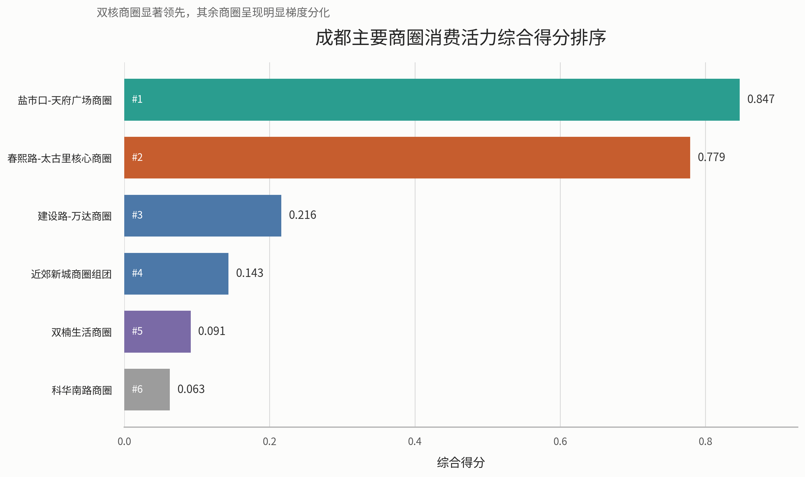
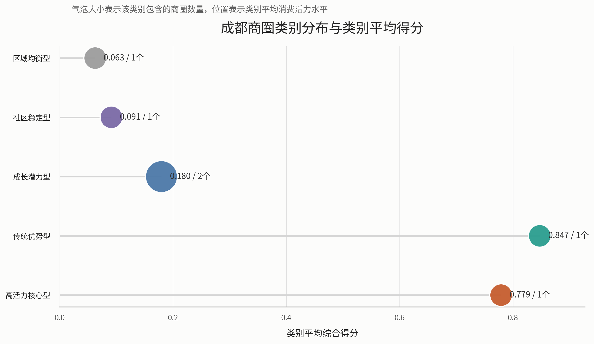

# 问题一 商圈消费活力评价指标体系构建

## 1.1 研究对象与分析思路

结合前期多城市背景比较结果，本文最终选择成都作为研究对象。原因在于：一方面，成都具备较强的年轻消费群体基础与首店政策支持，符合新式茶饮品牌的目标客群特征；另一方面，成都核心商圈层级清晰，既有春熙路-太古里这类城市地标型消费极，也有盐市口-天府广场等传统核心商圈，以及建设路、双楠、科华南路和近郊新城等不同功能层级商圈，适合开展消费活力的分层评价与空间比较。

针对问题一“构建商圈消费活力评价指标体系”的要求，本文采用“指标构建-数据标准化-组合赋权-综合评分-类型划分-空间分析”的技术路线。首先依据商业发展规律与题目要求，从商业规模、商业密度、商业成熟度、客流活跃度、核心吸引力、成长潜力和成本压力七个方面构建评价体系；其次，对不同量纲指标进行无量纲化处理；然后结合主观判断与客观信息，采用 AHP-熵权组合赋权方法计算指标权重；最后得到成都主要商圈消费活力综合得分，并据此划分商圈类型、分析空间分布格局。

## 1.2 商圈分析单元构建

原始数据中既包含具体商场点位，也包含少量重点商圈信息，直接以单个百货或单个门店作为评价对象，不利于反映真实商圈结构。因此，本文在尊重原始数据来源的基础上，对成都样本进行人工归并，形成 6 个更符合城市商业实际的商圈级分析单元，分别为：

1. 春熙路-太古里核心商圈  
2. 盐市口-天府广场商圈  
3. 建设路-万达商圈  
4. 双楠生活商圈  
5. 科华南路商圈  
6. 近郊新城商圈组团  

其中，春熙路-太古里核心商圈由春熙路步行街、太古里、伊势丹、伊滕盛华堂、太平洋、王府井和春熙洋华堂 1 店等点位归并形成，代表成都最具地标属性和外部吸引力的核心消费区；盐市口-天府广场商圈由盐市口和老城传统百货点位归并形成，体现传统中心商圈的商业积淀与规模优势；其余商圈则分别代表次级成长型、社区成熟型、区域生活型和近郊拓展型商业空间。

## 1.3 评价指标体系构建

结合题目要求与现有数据条件，本文最终构建 7 个核心指标，如表 1 所示。

### 表 1 商圈消费活力评价指标体系

| 指标名称 | 指标含义 | 指标方向 | 说明 |
|---|---|---|---|
| 来源点位数 | 商业规模 | 正向 | 反映商圈内可识别商业点位的数量 |
| 商场样本数 | 商业密度 | 正向 | 反映商圈商业载体集聚程度 |
| 商圈成熟度指数 | 商业成熟度 | 正向 | 综合样本数、街区属性等构建的成熟度指标 |
| 客流活跃度代理 | 客流活跃度 | 正向 | 重点商圈用客流明细，其他商圈按层级和先验信息估计 |
| 核心吸引力指数 | 核心吸引力 | 正向 | 衡量商圈是否具有城市地标、文旅外溢和品牌首选属性 |
| 类型潜力分 | 成长潜力 | 正向 | 根据商圈功能层级赋予发展潜力基准值 |
| 成本压力代理_租金 | 租金成本压力 | 逆向 | 反映商圈租金水平对经营可持续性的约束 |

上述指标中，前六项为正向指标，即指标值越大代表商圈消费活力越强；租金成本压力为逆向指标，即租金越高，对商圈中普通品牌的进入和持续经营约束越强，因此应在综合评价中作逆向处理。

## 1.4 模型构建与权重确定

### 1.4.1 指标标准化

由于各指标量纲不同，本文采用极差标准化方法进行无量纲化处理。对于正向指标，采用

$$
x'_{ij}=\frac{x_{ij}-\min(x_j)}{\max(x_j)-\min(x_j)}
$$

对于逆向指标，采用

$$
x'_{ij}=\frac{\max(x_j)-x_{ij}}{\max(x_j)-\min(x_j)}
$$

从而使各指标值均映射到 $[0,1]$ 区间，便于后续综合评价。

### 1.4.2 组合赋权方法

仅使用熵权法会导致“波动大但未必最重要”的指标权重被放大，而只依靠主观判断又会削弱数据客观性。因此，本文采用 AHP-熵权组合赋权方法。具体地，先依据商圈消费活力形成机制给出主观权重，再利用熵权法刻画各指标在样本之间的信息差异，最后按线性加权方式得到组合权重：

$$
w_j=\alpha w_j^{AHP}+(1-\alpha)w_j^{E}
$$

其中，$w_j^{AHP}$ 为主观权重，$w_j^{E}$ 为熵权，本文取 $\alpha=0.6$，即更强调商圈经营逻辑和消费规律，同时保留数据差异信息。

根据计算结果，7 个指标的组合权重如表 2 所示。

### 表 2 指标组合权重结果

| 指标名称 | 组合权重 |
|---|---:|
| 客流活跃度代理 | 0.2137 |
| 商圈成熟度指数 | 0.1862 |
| 商场样本数 | 0.1627 |
| 核心吸引力指数 | 0.1492 |
| 来源点位数 | 0.1374 |
| 类型潜力分 | 0.0880 |
| 成本压力代理_租金 | 0.0627 |

可以看出，客流活跃度、商业成熟度和商业密度是影响商圈消费活力的最关键因素，说明高频稳定客流、成熟商业生态和较高的商业集聚水平是形成高活力商圈的基础；核心吸引力权重也较高，说明在成都这类文商旅融合明显的城市中，具有城市地标属性和外部吸引力的商圈更容易形成消费热点。

### 1.4.3 综合评分模型

在得到标准化指标值和组合权重后，本文构建商圈消费活力综合评分模型：

$$
S_i=\sum_{j=1}^{m} w_j x'_{ij}
$$

其中，$S_i$ 为第 $i$ 个商圈的消费活力综合得分，$w_j$ 为第 $j$ 个指标的组合权重，$x'_{ij}$ 为标准化后的指标值。$S_i$ 越大，说明商圈消费活力越强。

## 1.5 综合评价结果与商圈分类

根据模型计算结果，成都 6 个主要商圈的综合得分、排名与类型划分如表 3 所示。

### 表 3 成都主要商圈消费活力评价结果

| 排名 | 商圈名称 | 综合得分 | 商圈类别 |
|---:|---|---:|---|
| 1 | 盐市口-天府广场商圈 | 0.8473 | 传统优势型 |
| 2 | 春熙路-太古里核心商圈 | 0.7791 | 高活力核心型 |
| 3 | 建设路-万达商圈 | 0.2161 | 成长潜力型 |
| 4 | 近郊新城商圈组团 | 0.1433 | 成长潜力型 |
| 5 | 双楠生活商圈 | 0.0913 | 社区稳定型 |
| 6 | 科华南路商圈 | 0.0627 | 区域均衡型 |

图 1 直观展示了成都主要商圈消费活力的排序结构。可以看出，盐市口-天府广场商圈与春熙路-太古里核心商圈显著高于其余商圈，说明成都消费活力呈现明显的“双核领先、梯度分化”特征。

从评价结果看，成都商圈消费活力呈现显著分层特征。

第一梯队为盐市口-天府广场商圈与春熙路-太古里核心商圈，两者明显高于其他商圈，构成成都中心城区的“双核格局”。其中，盐市口-天府广场商圈在商业规模、商场样本数和成熟度等方面表现突出，显示其传统中心商圈的存量优势；春熙路-太古里核心商圈虽然在租金成本方面压力较大，但凭借最高的客流活跃度和最强的核心吸引力，表现出显著的地标型消费特征。

第二梯队为建设路-万达商圈和近郊新城商圈组团。这类商圈当前总体规模和成熟度不及核心区，但具备较强发展弹性，其中建设路-万达商圈依托次级商业中心功能，显示出较明显的成长潜力；近郊新城商圈则反映了成都多中心扩张背景下外围消费空间的承接能力。

第三梯队为双楠生活商圈和科华南路商圈。前者更偏向成熟社区型消费，服务本地稳定客群，后者则兼具区域生活与次中心延伸功能，但在规模、客流和核心吸引力等指标上相对弱于前两类商圈，因此综合得分较低。

## 1.6 商圈类型划分

结合综合得分和商圈功能属性，本文将成都主要商圈划分为以下 5 类：

1. 高活力核心型：以春熙路-太古里核心商圈为代表，具有较强地标性、外来客吸引力和品牌首选属性。  
2. 传统优势型：以盐市口-天府广场商圈为代表，商业积淀深厚、规模大、成熟度高。  
3. 成长潜力型：以建设路-万达商圈和近郊新城商圈组团为代表，当前活力中等但具备明显成长空间。  
4. 社区稳定型：以双楠生活商圈为代表，消费结构稳定，辐射周边常住居民。  
5. 区域均衡型：以科华南路商圈为代表，功能相对综合但集聚度和外部吸引力偏弱。  

这种分类方式既满足题目中“将商圈划分为 3-5 种类型”的要求，也有利于后续针对不同商圈采取差异化的首店引入策略。

图 2 从类别层面进一步刻画了成都商圈的结构特征。其中，横轴表示该类别的平均综合得分，气泡大小表示该类别包含的商圈数量。可以看出，高活力核心型和传统优势型虽各仅包含 1 个代表商圈，但得分显著领先；成长潜力型包含 2 个商圈，是成都中心外围最具承接能力的一类商业空间。

## 1.7 空间分布特征分析

从空间分布上看，成都商圈消费活力呈现出明显的圈层与走廊式分布特征。

首先，中心城区形成“双核强集聚”格局。盐市口-天府广场商圈与春熙路-太古里核心商圈均位于城市核心区域，商业资源密集、品牌集聚程度高，是成都消费活力的主要承载区。这说明成都高活力消费空间总体仍集中于老城中心和地标商业片区。

其次，次级商圈沿城市扩展方向形成梯度承接。建设路-万达商圈与科华南路商圈体现出从中心城区向次中心延伸的空间结构，承担了分流中心商圈压力、承接区域性消费需求的功能。

再次，近郊新城商圈组团反映了外围消费空间的拓展趋势。随着城市多中心化和居住外扩，双流、华阳、新都、温江等片区逐步形成新的消费节点，但从当前结果看，其商业成熟度和综合活力仍与中心双核存在明显差距。

因此，成都商圈消费活力的总体空间格局可以概括为：

**中心双核强集聚，次级商圈梯度承接，近郊组团外拓延伸。**

## 1.8 问题一结论

本文基于成都商圈样本数据，构建了包含商业规模、商业密度、商业成熟度、客流活跃度、核心吸引力、成长潜力和成本压力在内的 7 指标消费活力评价体系，并采用 AHP-熵权组合赋权方法对主要商圈进行综合评价。结果表明，成都消费活力最高的商圈集中于中心城区，形成以盐市口-天府广场和春熙路-太古里为核心的双核结构；次级商圈和近郊商圈则体现出成长型与承接型特征。

这一结论为后续问题二的首店选址优化提供了明确基础：若强调品牌势能和城市展示效应，应重点考虑春熙路-太古里核心商圈；若强调成熟商业基础与稳定客群承载，则盐市口-天府广场商圈也具有较高参考价值。
