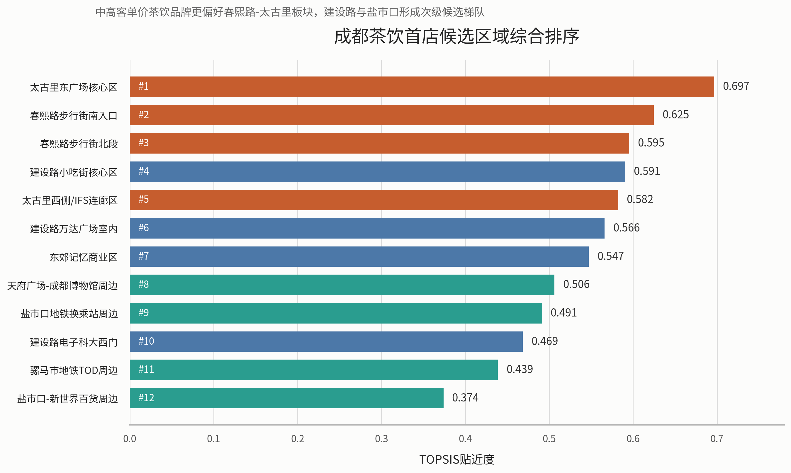
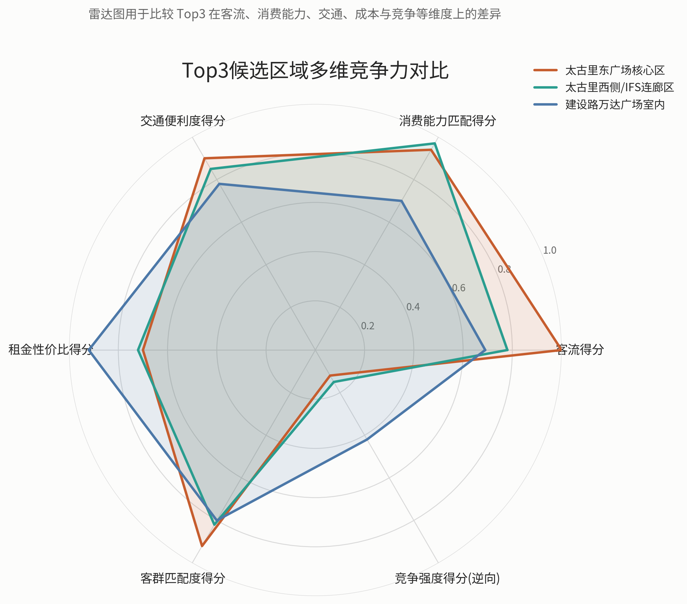
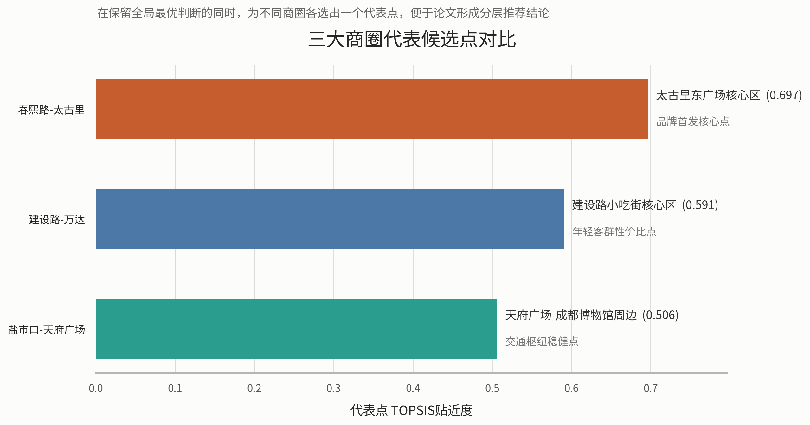

# 问题一 商圈消费活力评价指标体系构建

## 1.1 研究对象与分析思路

结合前期多城市背景比较结果，本文最终选择成都作为研究对象。原因在于：一方面，成都具备较强的年轻消费群体基础与首店政策支持，符合新式茶饮品牌的目标客群特征；另一方面，成都核心商圈层级清晰，既有春熙路-太古里这类城市地标型消费极，也有盐市口-天府广场等传统核心商圈，以及建设路、双楠、科华南路和近郊新城等不同功能层级商圈，适合开展消费活力的分层评价与空间比较。

针对问题一“构建商圈消费活力评价指标体系”的要求，本文采用“指标构建-数据标准化-组合赋权-综合评分-类型划分-空间分析”的技术路线。首先依据商业发展规律与题目要求，从商业规模、商业密度、商业成熟度、客流活跃度、核心吸引力、成长潜力和成本压力七个方面构建评价体系；其次，对不同量纲指标进行无量纲化处理；然后结合主观判断与客观信息，采用 AHP-熵权组合赋权方法计算指标权重；最后得到成都主要商圈消费活力综合得分，并据此划分商圈类型、分析空间分布格局。

## 1.2 商圈分析单元构建

原始数据中既包含具体商场点位，也包含少量重点商圈信息，直接以单个百货或单个门店作为评价对象，不利于反映真实商圈结构。因此，本文在尊重原始数据来源的基础上，对成都样本进行人工归并，形成 6 个更符合城市商业实际的商圈级分析单元，分别为：

1. 春熙路-太古里核心商圈  
2. 盐市口-天府广场商圈  
3. 建设路-万达商圈  
4. 双楠生活商圈  
5. 科华南路商圈  
6. 近郊新城商圈组团  

其中，春熙路-太古里核心商圈由春熙路步行街、太古里、伊势丹、伊滕盛华堂、太平洋、王府井和春熙洋华堂 1 店等点位归并形成，代表成都最具地标属性和外部吸引力的核心消费区；盐市口-天府广场商圈由盐市口和老城传统百货点位归并形成，体现传统中心商圈的商业积淀与规模优势；其余商圈则分别代表次级成长型、社区成熟型、区域生活型和近郊拓展型商业空间。

## 1.3 评价指标体系构建

结合题目要求与现有数据条件，本文最终构建 7 个核心指标，如表 1 所示。

### 表 1 商圈消费活力评价指标体系

| 指标名称 | 指标含义 | 指标方向 | 说明 |
|---|---|---|---|
| 来源点位数 | 商业规模 | 正向 | 反映商圈内可识别商业点位的数量 |
| 商场样本数 | 商业密度 | 正向 | 反映商圈商业载体集聚程度 |
| 商圈成熟度指数 | 商业成熟度 | 正向 | 综合样本数、街区属性等构建的成熟度指标 |
| 客流活跃度代理 | 客流活跃度 | 正向 | 重点商圈用客流明细，其他商圈按层级和先验信息估计 |
| 核心吸引力指数 | 核心吸引力 | 正向 | 衡量商圈是否具有城市地标、文旅外溢和品牌首选属性 |
| 类型潜力分 | 成长潜力 | 正向 | 根据商圈功能层级赋予发展潜力基准值 |
| 成本压力代理_租金 | 租金成本压力 | 逆向 | 反映商圈租金水平对经营可持续性的约束 |

上述指标中，前六项为正向指标，即指标值越大代表商圈消费活力越强；租金成本压力为逆向指标，即租金越高，对商圈中普通品牌的进入和持续经营约束越强，因此应在综合评价中作逆向处理。

## 1.4 模型构建与权重确定

### 1.4.1 指标标准化

由于各指标量纲不同，本文采用极差标准化方法进行无量纲化处理。对于正向指标，采用

$$
x'_{ij}=\frac{x_{ij}-\min(x_j)}{\max(x_j)-\min(x_j)}
$$

对于逆向指标，采用

$$
x'_{ij}=\frac{\max(x_j)-x_{ij}}{\max(x_j)-\min(x_j)}
$$

从而使各指标值均映射到 $[0,1]$ 区间，便于后续综合评价。

### 1.4.2 组合赋权方法

仅使用熵权法会导致“波动大但未必最重要”的指标权重被放大，而只依靠主观判断又会削弱数据客观性。因此，本文采用 AHP-熵权组合赋权方法。具体地，先依据商圈消费活力形成机制给出主观权重，再利用熵权法刻画各指标在样本之间的信息差异，最后按线性加权方式得到组合权重：

$$
w_j=\alpha w_j^{AHP}+(1-\alpha)w_j^{E}
$$

其中，$w_j^{AHP}$ 为主观权重，$w_j^{E}$ 为熵权，本文取 $\alpha=0.6$，即更强调商圈经营逻辑和消费规律，同时保留数据差异信息。

根据计算结果，7 个指标的组合权重如表 2 所示。

### 表 2 指标组合权重结果

| 指标名称 | 组合权重 |
|---|---:|
| 客流活跃度代理 | 0.2137 |
| 商圈成熟度指数 | 0.1862 |
| 商场样本数 | 0.1627 |
| 核心吸引力指数 | 0.1492 |
| 来源点位数 | 0.1374 |
| 类型潜力分 | 0.0880 |
| 成本压力代理_租金 | 0.0627 |

可以看出，客流活跃度、商业成熟度和商业密度是影响商圈消费活力的最关键因素，说明高频稳定客流、成熟商业生态和较高的商业集聚水平是形成高活力商圈的基础；核心吸引力权重也较高，说明在成都这类文商旅融合明显的城市中，具有城市地标属性和外部吸引力的商圈更容易形成消费热点。

### 1.4.3 综合评分模型

在得到标准化指标值和组合权重后，本文构建商圈消费活力综合评分模型：

$$
S_i=\sum_{j=1}^{m} w_j x'_{ij}
$$

其中，$S_i$ 为第 $i$ 个商圈的消费活力综合得分，$w_j$ 为第 $j$ 个指标的组合权重，$x'_{ij}$ 为标准化后的指标值。$S_i$ 越大，说明商圈消费活力越强。

## 1.5 综合评价结果与商圈分类

根据模型计算结果，成都 6 个主要商圈的综合得分、排名与类型划分如表 3 所示。

### 表 3 成都主要商圈消费活力评价结果

| 排名 | 商圈名称 | 综合得分 | 商圈类别 |
|---:|---|---:|---|
| 1 | 盐市口-天府广场商圈 | 0.8473 | 传统优势型 |
| 2 | 春熙路-太古里核心商圈 | 0.7791 | 高活力核心型 |
| 3 | 建设路-万达商圈 | 0.2161 | 成长潜力型 |
| 4 | 近郊新城商圈组团 | 0.1433 | 成长潜力型 |
| 5 | 双楠生活商圈 | 0.0913 | 社区稳定型 |
| 6 | 科华南路商圈 | 0.0627 | 区域均衡型 |

图 1 直观展示了成都主要商圈消费活力的排序结构。可以看出，盐市口-天府广场商圈与春熙路-太古里核心商圈显著高于其余商圈，说明成都消费活力呈现明显的“双核领先、梯度分化”特征。

从评价结果看，成都商圈消费活力呈现显著分层特征。

第一梯队为盐市口-天府广场商圈与春熙路-太古里核心商圈，两者明显高于其他商圈，构成成都中心城区的“双核格局”。其中，盐市口-天府广场商圈在商业规模、商场样本数和成熟度等方面表现突出，显示其传统中心商圈的存量优势；春熙路-太古里核心商圈虽然在租金成本方面压力较大，但凭借最高的客流活跃度和最强的核心吸引力，表现出显著的地标型消费特征。

第二梯队为建设路-万达商圈和近郊新城商圈组团。这类商圈当前总体规模和成熟度不及核心区，但具备较强发展弹性，其中建设路-万达商圈依托次级商业中心功能，显示出较明显的成长潜力；近郊新城商圈则反映了成都多中心扩张背景下外围消费空间的承接能力。

第三梯队为双楠生活商圈和科华南路商圈。前者更偏向成熟社区型消费，服务本地稳定客群，后者则兼具区域生活与次中心延伸功能，但在规模、客流和核心吸引力等指标上相对弱于前两类商圈，因此综合得分较低。

## 1.6 商圈类型划分

结合综合得分和商圈功能属性，本文将成都主要商圈划分为以下 5 类：

1. 高活力核心型：以春熙路-太古里核心商圈为代表，具有较强地标性、外来客吸引力和品牌首选属性。  
2. 传统优势型：以盐市口-天府广场商圈为代表，商业积淀深厚、规模大、成熟度高。  
3. 成长潜力型：以建设路-万达商圈和近郊新城商圈组团为代表，当前活力中等但具备明显成长空间。  
4. 社区稳定型：以双楠生活商圈为代表，消费结构稳定，辐射周边常住居民。  
5. 区域均衡型：以科华南路商圈为代表，功能相对综合但集聚度和外部吸引力偏弱。  

这种分类方式既满足题目中“将商圈划分为 3-5 种类型”的要求，也有利于后续针对不同商圈采取差异化的首店引入策略。

图 2 从类别层面进一步刻画了成都商圈的结构特征。其中，横轴表示该类别的平均综合得分，气泡大小表示该类别包含的商圈数量。可以看出，高活力核心型和传统优势型虽各仅包含 1 个代表商圈，但得分显著领先；成长潜力型包含 2 个商圈，是成都中心外围最具承接能力的一类商业空间。

## 1.7 空间分布特征分析

从空间分布上看，成都商圈消费活力呈现出明显的圈层与走廊式分布特征。

首先，中心城区形成“双核强集聚”格局。盐市口-天府广场商圈与春熙路-太古里核心商圈均位于城市核心区域，商业资源密集、品牌集聚程度高，是成都消费活力的主要承载区。这说明成都高活力消费空间总体仍集中于老城中心和地标商业片区。

其次，次级商圈沿城市扩展方向形成梯度承接。建设路-万达商圈与科华南路商圈体现出从中心城区向次中心延伸的空间结构，承担了分流中心商圈压力、承接区域性消费需求的功能。

再次，近郊新城商圈组团反映了外围消费空间的拓展趋势。随着城市多中心化和居住外扩，双流、华阳、新都、温江等片区逐步形成新的消费节点，但从当前结果看，其商业成熟度和综合活力仍与中心双核存在明显差距。

因此，成都商圈消费活力的总体空间格局可以概括为：

**中心双核强集聚，次级商圈梯度承接，近郊组团外拓延伸。**

## 1.8 问题一结论

本文基于成都商圈样本数据，构建了包含商业规模、商业密度、商业成熟度、客流活跃度、核心吸引力、成长潜力和成本压力在内的 7 指标消费活力评价体系，并采用 AHP-熵权组合赋权方法对主要商圈进行综合评价。结果表明，成都消费活力最高的商圈集中于中心城区，形成以盐市口-天府广场和春熙路-太古里为核心的双核结构；次级商圈和近郊商圈则体现出成长型与承接型特征。

这一结论为后续问题二的首店选址优化提供了明确基础：若强调品牌势能和城市展示效应，应重点考虑春熙路-太古里核心商圈；若强调成熟商业基础与稳定客群承载，则盐市口-天府广场商圈也具有较高参考价值。

# 问题二 成都茶饮首店选址优化

## 2.1 研究目标与候选区域设定

在问题一完成成都商圈消费活力识别的基础上，问题二进一步聚焦“某新式茶饮品牌在成都开设首店时，应优先选择哪个具体区域”这一决策问题。与问题一的商圈层级评价不同，问题二需要将分析单元细化到候选落位点层面，从而兼顾品牌展示、目标客群触达、经营可持续性与竞争环境等多重因素。

结合前文对成都商圈结构的判断，本文从春熙路-太古里、盐市口-天府广场和建设路-万达三大核心商圈中筛选 12 个候选区域，涵盖步行街入口、开放式街区、购物中心、地铁上盖、校园周边、文旅广场等不同类型空间。这些候选区域既包含城市最强势能点位，也保留了租金更友好、青年客群更集中的次优区域，从而能够较完整地刻画成都茶饮首店的可选空间。

## 2.2 指标体系构建

考虑到题目所讨论的品牌并非低价现制饮品，而更接近客单价 30-40 元的新式茶饮首店，因此本文在“年轻人多”之外，额外强调消费承受力与品牌调性的匹配程度。最终构建 5 个一级维度、11 个二级指标的评价体系，如表 4 所示。

### 表 4 成都茶饮首店选址评价指标体系

| 一级维度 | 二级指标 | 指标方向 | 指标说明 |
|---|---|---|---|
| 客群匹配 | 客群匹配度得分、年轻人口占比 | 正向 | 反映目标年轻消费群体的聚集程度 |
| 消费支撑 | 消费能力匹配度 | 正向 | 反映区域消费结构与 30-40 元客单价的适配程度 |
| 客流潜力 | 日均客流量、夜间活跃度、周末节假日热度、社交媒体热度 | 正向 | 衡量区域的曝光能力与持续引流能力 |
| 交通可达 | 交通便利度、距地铁距离 | 正向/逆向 | 反映到达便利性和通勤导流能力 |
| 成本竞争 | 租金性价比、平均租金、竞争强度 | 正向/逆向 | 衡量经营成本压力与同类门店竞争压力 |

其中，“消费能力匹配度”是本题中的关键修正指标。若仅以年轻人口占比作为判断依据，则建设路高校周边等区域会因学生客群集中而获得较高评分，但对于客单价 30-40 元的品牌而言，纯校园型客群未必具有足够稳定的消费承受力。因此，本文综合写字楼、购物中心、文旅属性、既有客群结构和租金水平等因素构造消费能力匹配度指标，并对“高校邻近但缺乏办公和商业支撑”的区域设置适度惩罚，从而避免模型高估低消费承受力区域。

## 2.3 模型方法与权重确定

### 2.3.1 标准化与组合赋权

由于候选区域评价涉及客流、租金、距离和结构性评分等多种量纲，本文同样采用极差标准化对各指标进行无量纲化处理。对于日均客流量、交通便利度、租金性价比等正向指标，指标值越大越优；对于平均租金、竞争强度和距地铁距离等逆向指标，则按逆向方式标准化。

在权重确定上，本文继续采用 AHP-熵权组合赋权方法。一方面，通过主观赋权体现首店经营逻辑，即更重视客流、客群和消费能力等核心因素；另一方面，利用熵权法反映不同候选区域在指标上的客观差异，最终兼顾理论判断与数据特征。

根据计算结果，日均客流量、客群匹配度、交通便利度、消费能力匹配度和租金性价比的综合权重居前，说明对于首店而言，“高曝光 + 高适配 + 可持续经营”是比单一低成本更重要的决策原则。

### 2.3.2 TOPSIS 综合排序模型

在得到标准化指标矩阵与组合权重后，本文采用 TOPSIS 方法对候选区域进行综合排序。该方法通过比较各候选点与理想最优解、理想最劣解的相对距离，得到贴近度系数：

$$
C_i=\frac{D_i^-}{D_i^++D_i^-}
$$

其中，$D_i^+$ 表示第 $i$ 个候选区域到理想最优解的距离，$D_i^-$ 表示其到理想最劣解的距离，$C_i$ 越大，说明该区域越接近理想选址方案。

## 2.4 综合排序结果与最优区域推荐

根据模型计算结果，成都茶饮首店候选区域的综合排序前 3 位如表 5 所示。

### 表 5 成都茶饮首店全局 Top3 推荐结果

| 排名 | 候选区域 | 所属商圈 | TOPSIS贴近度 | 推荐等级 |
|---:|---|---|---:|---|
| 1 | 太古里东广场核心区 | 春熙路-太古里 | 0.6967 | 首选 |
| 2 | 春熙路步行街南入口 | 春熙路-太古里 | 0.6247 | 备选1 |
| 3 | 春熙路步行街北段 | 春熙路-太古里 | 0.5954 | 备选2 |

从全局排序结果看，前三名均位于春熙路-太古里板块，说明对于中高客单价茶饮品牌而言，成都最优首店落位依然集中在城市展示度最高、客流最强、消费能力最匹配的核心区域。其中，太古里东广场核心区在目标客群匹配、消费能力匹配、日均客流量和交通可达性等方面均表现突出，因此被确定为首选点位。

春熙路步行街南入口与春熙路步行街北段同样位列前三，说明春熙路-太古里不仅在单点上优势突出，而且在街区内部具备连续性的高质量落位带。这种结果与问题一中“春熙路-太古里是成都最具品牌首发属性的高活力核心型商圈”这一判断相互印证。

## 2.5 多维对比与分层推荐

尽管全局 Top3 均落在同一商圈，但若在论文中仅给出这一结论，容易造成“结论过于集中”的印象，也不利于形成更有解释力的商业决策建议。因此，本文进一步从多维得分和商圈代表性两个角度展开分析。

首先，从 Top3 多维比较结果看，太古里东广场核心区在客流、消费能力匹配和客群匹配等方面整体最强；春熙路步行街南入口和北段则在交通便利与夜间活跃性上保持较高水平，但在消费支撑和竞争压力方面略逊于最优点位。

图 4 表明，Top3 候选点的优势具有较高一致性，均属于高客流、高曝光、高客群匹配的核心商业街区。这说明模型并未出现异常偏移，而是当前数据条件下，春熙路-太古里板块确实在首店经营逻辑上占据绝对优势。

其次，为避免推荐结果过于单一，本文进一步采用“分商圈代表推荐”的方式，从三个核心商圈中分别选出综合表现最优的代表点位，如表 6 所示。

### 表 6 成都三大核心商圈代表候选点推荐

| 商圈 | 代表候选点 | TOPSIS贴近度 | 推荐定位 |
|---|---|---:|---|
| 春熙路-太古里 | 太古里东广场核心区 | 0.6967 | 品牌首发核心点 |
| 建设路-万达 | 建设路小吃街核心区 | 0.5907 | 年轻客群性价比点 |
| 盐市口-天府广场 | 天府广场-成都博物馆周边 | 0.5062 | 交通枢纽稳健点 |

这一分层推荐结果具有更强的策略含义。若品牌强调首发声量、城市形象和高能级展示，应优先选择太古里东广场核心区；若品牌更关注年轻消费群体聚集、租金效率和夜间活力，则建设路小吃街核心区可作为更高性价比的备选；若品牌偏好交通导入稳定、文旅客流可承接、经营风格相对稳健的区域，则天府广场-成都博物馆周边更具参考价值。

特别需要指出的是，建设路小吃街核心区虽然年轻客群浓度高、租金更友好，但其消费能力匹配度显著低于太古里板块。这说明建设路更适合平价、高频、强社交型茶饮品牌，而对于 30-40 元客单价、强调品牌调性与展示感的首店而言，仍不如春熙路-太古里更具适配性。

## 2.6 问题二结论

本文基于成都 12 个候选区域，构建了涵盖客群匹配、消费能力支撑、客流潜力、交通可达和成本竞争环境的首店选址评价体系，并采用 AHP-熵权组合赋权与 TOPSIS 方法完成综合排序。结果表明，成都茶饮首店的全局最优区域集中于春熙路-太古里板块，其中太古里东广场核心区为首选点位，春熙路步行街南入口和北段为次优备选。

同时，考虑到论文表达和实际决策都需要兼顾多情景比较，本文进一步给出了分商圈代表推荐结论：春熙路-太古里适合品牌首发型落位，建设路-万达适合年轻客群性价比型落位，盐市口-天府广场适合交通导入与稳健经营型落位。由此，问题二的最终建议可概括为：

**首选太古里东广场核心区，备选春熙路步行街高流量带，并以建设路和盐市口代表点作为差异化备选方案。**
